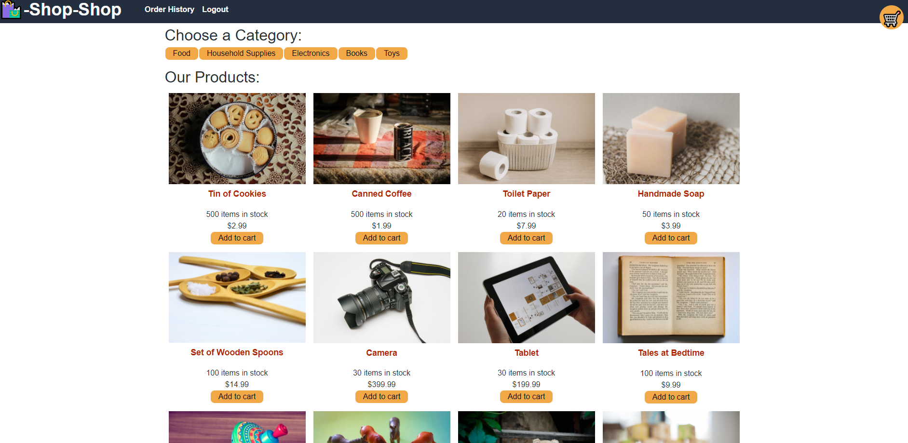

# State Challenge: Redux Store

## Description

Shop Shop is an e-commerce application that allows users to shop for various items, add these products to the shopping cart, manage the shopping cart by increasing and decreasing quantities, check out their purchases and see their order history. This application is built using Node.js, GraphQL, Apollo Server, MongoDB and it is using React for the front end. It has been refactored to use Redux for state management instead of manual install. 

## Table of Contents
  - [Description](#description)
  - [Installation](#installation)
  - [Usage](#usage)
  - [Screenshot](#screenshot)
  - [Questions](#questions)

## Installation
 
If you would like to modify the code, clone the project onto your computer, and run npm install in the root directory, in the client directory, and in the server directory.
From the root directory, type npm start to start the Express and GraphQL/Apollo servers. The homepage of the application will open in your default browser.

## Usage

Live Deployment: [View Application](https://warm-garden-46229.herokuapp.com/)

This application allows to shop for various items, add these products to the shopping cart, manage the shopping cart by increasing and decreasing quantities, check out their purchases and see their order history.

## Screenshot

## Questions
  
Find me on GitHub: [damatgre](https://github.com/damatgre)

  